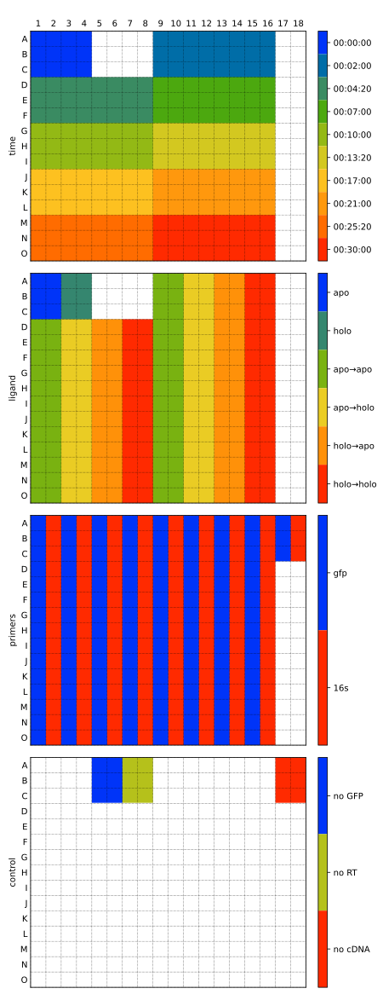

***************************************************
``wellmap`` — File format for 96-well plate layouts
***************************************************

Many medium-throughput experiments produce data in 24-, 96-, or 384-well plate 
format.  However, it can be a challenge to keep track of which wells (e.g. A1, 
B2, etc.) correspond to which experimental conditions (e.g. genotype, drug 
concentration, replicate number, etc.) for large numbers of experiments.  It 
can also be a challenge to write analysis scripts flexible enough to handle the 
different plate layouts that will inevitably come up as more and more 
experiments are run.

The ``wellmap`` package solves these challenges by introducing a `TOML-based 
file format`__ that succinctly describes the organization of wells on plates.  
The file format is designed to be human-readable and -writable, so it can serve 
as a standalone digital record.  The file format can also be easily parsed in 
python and R to help write analysis scripts that will work regardless of how 
you (or your collaborators) organize wells on your plates.

__ https://wellmap.readthedocs.io/en/latest/file_format.html

.. image:: https://img.shields.io/pypi/v/wellmap.svg
   :target: https://pypi.python.org/pypi/wellmap

.. image:: https://img.shields.io/pypi/pyversions/wellmap.svg
   :target: https://pypi.python.org/pypi/wellmap

.. image:: https://img.shields.io/travis/kalekundert/wellmap.svg
   :target: https://travis-ci.org/kalekundert/wellmap

.. image:: https://readthedocs.org/projects/wellmap/badge/?version=latest
   :target: http://wellmap.readthedocs.io/en/latest/

.. image:: https://img.shields.io/coveralls/kalekundert/wellmap.svg
   :target: https://coveralls.io/github/kalekundert/wellmap?branch=master

Documentation
=============
See the complete documentation `here <http://wellmap.readthedocs.io/>`_.

