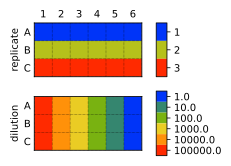
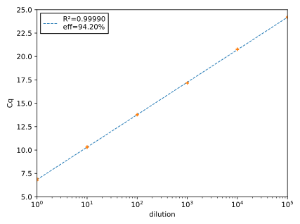

***********************
Basic usage with python
***********************

The following steps show how to get started with :mod:`wellmap` in python:

.. make-list-from-sections::

1. Install wellmap
==================
Install :mod:`wellmap` from PyPI.  Note that python≥3.6 is required:

.. code-block:: console

  $ pip install wellmap

2. Describe the plate layout
============================
Write a `TOML file <file_format>` describing the layout of an experiment.  For 
example, the following layout might be used for a standard curve:

.. literalinclude:: basic_usage/std_curve.toml
   :language: toml
   :caption: :download:`std_curve.toml <basic_usage/std_curve.toml>`

3. Confirm the plate layout
===========================
Confirm that the layout is correct by using the :prog:`wellmap` command-line 
program to produce a visualization of the layout.  This is an important step, 
because it's much easier to spot mistakes in the visualization than in the 
layout file itself.

.. code-block:: console

   $ wellmap std_curve.toml

This map shows that:

- Each row is a different replicate.
- Each column is a different dilution.

It is also possible to create maps like this directly from python, which may be 
useful in interactive sessions such as Jupyter notebooks:

.. code-block:: pycon

   >>> import wellmap
   >>> wellmap.show("std_curve.toml")
   <Figure size 320.75x255 with 4 Axes>

4. Prepare the data
===================
Load the data from the experiment in question into a tidy_ data frame.  Tidy 
data are easier to work with in general, and are required by :mod:`wellmap` in 
particular.  If you aren't familiar with the concept of tidy data, `this 
article`__ is a good introduction.  The basic idea is to ensure that:

__ https://tomaugspurger.github.io/modern-5-tidy

- Each variable is represented by a single column.
- Each observation is represented by a single row.

If possible, it's best to export data from the instrument that collected it 
directly to a tidy format.  When this isn't possible, though, you'll need to 
tidy the data yourself.  For example, consider the following data (which 
corresponds to the layout from above).  This is qPCR data, where a higher 
:math:`C_q` value indicates that less material is present.  The data are shaped 
like the plate itself, e.g. a row in the data for every row on the plate, and a 
column in the data for every column on the plate.  It's not uncommon for 
microplate instruments to export data in this format.

.. csv-table:: :download:`std_curve.csv <basic_usage/std_curve.csv>`
   :file: basic_usage/std_curve.csv
   :header-rows: 1

Below is the code to load this data into a tidy `pandas.DataFrame` with the 
following columns:

- *row*: A letter identifying a row on the microplate, e.g. A-H
- *col*: A number identifying a column on the microplate, e.g. 1-12
- *Cq*: The :math:`C_q` value measured for the identified well. 
  
.. code-block:: pycon

    >>> import pandas as pd
    >>> def load_cq(path):
    ...     return (pd
    ...             .read_csv(path)
    ...             .rename(columns={'Cq': 'row'})
    ...             .melt(
    ...                     id_vars=['row'],
    ...                     var_name='col',
    ...                     value_name='Cq',
    ...             )
    ...     )
    >>> data = load_cq('std_curve.csv')
    >>> data
       row col         Cq
    0    A   1  24.180859
    1    B   1  24.157118
    2    C   1  24.238230
    3    A   2  20.740120
    4    B   2  20.779703
    5    C   2  20.787008
    6    A   3  17.183802
    7    B   3  17.171795
    8    C   3  17.147598
    9    A   4  13.774300
    10   B   4  13.768831
    11   C   4  13.779314
    12   A   5  10.294983
    13   B   5  10.362967
    14   C   5  10.292967
    15   A   6   6.967062
    16   B   6   6.870273
    17   C   6   6.735704

5. Label the data
=================
Use `wellmap.load()` to associate the labels specified in the TOML file (e.g. the 
dilutions and replicates) with the experimental data (e.g. the :math:`C_q` 
values).  This process has three steps:

- Load a data frame containing the data (see above).
- Load another data frame containing the labels.
- Merge the two data frames.

For the sake of clarity and completeness, we will first show how to perform 
these steps `manually <#manual-merge>`__.  Practically, though, it's easier to 
let :mod:`wellmap` perform them `automatically <#automatic-merge>`__.

Manual merge
------------
Use the `wellmap.load()` function to create a `pandas.DataFrame` containing the 
information from the TOML file.  This data frame will have columns for each 
label we specified: *replicate*, *dilution*.  It will also have six columns 
identifying the wells in different ways: *well*, *well0*, *row*, *col*, 
*row_i*, *col_j*.  These columns are redundant, but this redundancy makes it 
easier to merge the labels with the data.  For example, if the wells are named 
"A1,A2,..." in the data, the *well* column can be used for the merge.  If the 
wells are named "A01,A02,...", the *well0* column can be used instead.  If the 
wells are named in some non-standard way, the *row_i* and *col_j* columns can 
be used to calculate an appropriate merge column.

.. code-block:: pycon

   >>> import wellmap
   >>> labels = wellmap.load('std_curve.toml')
   >>> labels
      well well0 row col  row_i  col_j  replicate  dilution
   0    A1   A01   A   1      0      0          1  100000.0
   1    A2   A02   A   2      0      1          1   10000.0
   2    A3   A03   A   3      0      2          1    1000.0
   3    A4   A04   A   4      0      3          1     100.0
   4    A5   A05   A   5      0      4          1      10.0
   5    A6   A06   A   6      0      5          1       1.0
   6    B1   B01   B   1      1      0          2  100000.0
   7    B2   B02   B   2      1      1          2   10000.0
   8    B3   B03   B   3      1      2          2    1000.0
   9    B4   B04   B   4      1      3          2     100.0
   10   B5   B05   B   5      1      4          2      10.0
   11   B6   B06   B   6      1      5          2       1.0
   12   C1   C01   C   1      2      0          3  100000.0
   13   C2   C02   C   2      2      1          3   10000.0
   14   C3   C03   C   3      2      2          3    1000.0
   15   C4   C04   C   4      2      3          3     100.0
   16   C5   C05   C   5      2      4          3      10.0
   17   C6   C06   C   6      2      5          3       1.0

Use the :func:`pandas.merge` function to associate the labels with the data.  
In this case, both data frames have columns named *row* and *col*, so 
:mod:`pandas` will automatically use those for the merge.  It is also easy to 
merge using columns with different names; see the documentation on 
:func:`pandas.merge` for more information.

.. code-block:: pycon

   >>> import pandas as pd
   >>> df = pd.merge(labels, data)
   >>> df
      well well0 row col  row_i  col_j  replicate  dilution         Cq
   0    A1   A01   A   1      0      0          1  100000.0  24.180859
   1    A2   A02   A   2      0      1          1   10000.0  20.740120
   2    A3   A03   A   3      0      2          1    1000.0  17.183802
   3    A4   A04   A   4      0      3          1     100.0  13.774300
   4    A5   A05   A   5      0      4          1      10.0  10.294983
   5    A6   A06   A   6      0      5          1       1.0   6.967062
   6    B1   B01   B   1      1      0          2  100000.0  24.157118
   7    B2   B02   B   2      1      1          2   10000.0  20.779703
   8    B3   B03   B   3      1      2          2    1000.0  17.171795
   9    B4   B04   B   4      1      3          2     100.0  13.768831
   10   B5   B05   B   5      1      4          2      10.0  10.362967
   11   B6   B06   B   6      1      5          2       1.0   6.870273
   12   C1   C01   C   1      2      0          3  100000.0  24.238230
   13   C2   C02   C   2      2      1          3   10000.0  20.787008
   14   C3   C03   C   3      2      2          3    1000.0  17.147598
   15   C4   C04   C   4      2      3          3     100.0  13.779314
   16   C5   C05   C   5      2      4          3      10.0  10.292967
   17   C6   C06   C   6      2      5          3       1.0   6.735704

Automatic merge
---------------
While it's good to understand how the labels are merged with the data, it's 
better to let :mod:`wellmap` perform the merge for you.  Not only is this more 
succinct, it also handles some tricky corner cases behind the scenes, e.g.  
layouts with multiple data files.  

To load *and* merge the data using :func:`wellmap.load`, you need to provide the 
following arguments:

- **data_loader**: A function that accepts a path to a file and returns a 
  :class:`pandas.DataFrame` containing the data from that file.  Note that the 
  function we wrote in the previous section fulfills these requirements.  If 
  the raw data are tidy to begin with, it is often possible to directly use 
  :func:`pandas.read_csv` or similar for this argument.

- **merge_cols**: An indication of which columns to merge.  In the snippet 
  below, ``True`` means to use any columns that are shared between the two data 
  frames (e.g. that have the same name).  You can also use a dictionary to be 
  more explicit about which columns to merge on.

Here we also provide the **path_guess** argument, which specifies that the 
experimental data can be found in a CSV file with the same base name as the 
layout.  It also would've been possible to specify the path to the CSV directly 
from the TOML file (see `meta.path`), in which case this argument would've been 
unnecessary.

.. code-block:: pycon

   >>> df = wellmap.load(
   ...         'std_curve.toml',
   ...         data_loader=load_cq,
   ...         merge_cols=True,
   ...         path_guess='{0.stem}.csv',
   ... )
   >>> df
      well well0 row  ... replicate  dilution         Cq
   0    A1   A01   A  ...         1  100000.0  24.180859
   1    A2   A02   A  ...         1   10000.0  20.740120
   2    A3   A03   A  ...         1    1000.0  17.183802
   3    A4   A04   A  ...         1     100.0  13.774300
   4    A5   A05   A  ...         1      10.0  10.294983
   5    A6   A06   A  ...         1       1.0   6.967062
   6    B1   B01   B  ...         2  100000.0  24.157118
   7    B2   B02   B  ...         2   10000.0  20.779703
   8    B3   B03   B  ...         2    1000.0  17.171795
   9    B4   B04   B  ...         2     100.0  13.768831
   10   B5   B05   B  ...         2      10.0  10.362967
   11   B6   B06   B  ...         2       1.0   6.870273
   12   C1   C01   C  ...         3  100000.0  24.238230
   13   C2   C02   C  ...         3   10000.0  20.787008
   14   C3   C03   C  ...         3    1000.0  17.147598
   15   C4   C04   C  ...         3     100.0  13.779314
   16   C5   C05   C  ...         3      10.0  10.292967
   17   C6   C06   C  ...         3       1.0   6.735704
   <BLANKLINE>
   [18 rows x 10 columns]

6. Analyze the data
===================
Analyze the data given the connection between the labels and the data.  This 
step doesn't involve :mod:`wellmap`, but is included here for completeness.  
The example below makes a linear regression of the data in log-space:

.. literalinclude:: basic_usage/std_curve.py
   :language: python
   :caption: :download:`std_curve.py <basic_usage/std_curve.py>`

   R² is a measure of how well the line fits the data.  In this case, the 
   fit is very good.  Note that there are three data points for each 
   dilution, but they are hard to tell apart because they are almost perfectly 
   superimposed.  Efficiency is a measure of how well the qPCR reaction worked, 
   or more specifically, how close the amount of DNA came to doubling (as would 
   be expected) on each cycle.  100% indicates perfect doubling; 94% is a 
   little on the low side.

.. _tidy: https://www.jstatsoft.org/article/view/v059i10

